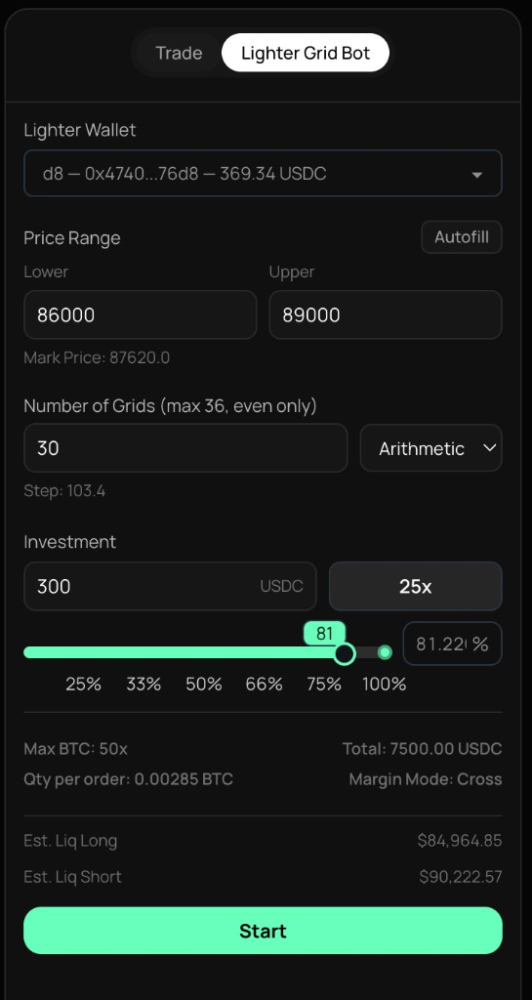

# Vari Grid Bot

### What is a Grid Bot?

A Grid Bot is an automated trading strategy that places multiple buy(Long) and sell(Short) orders at preset price intervals, creating a "grid" of orders. It profits from natural market volatility by buying low and selling high repeatedly — without requiring you to predict market direction.

**How it works:** The bot divides your chosen price range into equal levels (grids). When price drops to a grid level, it opens a long position. When price rises to the next level, it closes for profit. This cycle repeats automatically 24/7.

<figure>
  
  <figcaption><strong>Gridbot limit orders</strong> — BTC/USD, 5m, <strong>Vari</strong>: red dashed lines above price = sell side of the grid; green dashed lines below = buy side; horizontal bands are resting limit orders until price trades through them.</figcaption>
</figure>

***

### Prerequisites

Before you start, make sure you have:

1. **A Vari API Wallet** — Add one through Dextrabot's Wallet Management. See the [How to Get API Key](https://docs.dextrabot.com/farm/vari-farming-module#getting-your-api-keys) documentation for detailed steps.
2. **USDC Balance** — Fund your Vari wallet with USDC. Minimum depends on your leverage settings.
3. **Beta Access Code** — Get your invite code from our [Discord](https://discord.gg/dextrabot) or [Twitter/X](https://x.com/dextrabot).

<figure><figcaption></figcaption></figure>

***

### Quick Start Guide

Get your grid bot running in under 5 minutes:

1. **Go to Terminal** — Navigate to `app.dextrabot.com/terminal/BTC` (or any trading pair)
2. **Switch to Vari** — Click the **Vari** toggle in the top-left corner (next to other venues when available)
3. **Select Grid Bot** — On the right panel, click the **Vari Grid Bot** tab
4. **Choose Wallet** — Select your funded Vari wallet from the dropdown
5. **Configure Settings** — Set your price range, number of grids, and investment amount (or click **Autofill** for suggested values)
6. **Start!** — Click the green **Start** button and let the bot do its magic ✨

<figure><figcaption></figcaption></figure>

***

### Configuration Parameters

<figure>
  
  <figcaption><strong>Gridbot order form</strong> — Vari Grid Bot tab: wallet and USDC balance; <strong>Lower / Upper</strong> range with <strong>Autofill</strong> and mark price; <strong>Number of Grids</strong> (even, max 36), <strong>Grid type</strong> (e.g. Arithmetic), <strong>Step</strong>; <strong>Investment</strong>, leverage, allocation slider; max asset leverage, qty per order, total, cross margin; <strong>Est. Liq Long / Short</strong>; green <strong>Start</strong>.</figcaption>
</figure>

Here's a detailed breakdown of each setting:

| Parameter               | Description                                                                                                                                     |
| ----------------------- | ----------------------------------------------------------------------------------------------------------------------------------------------- |
| **Vari Wallet**         | Select the wallet you want the bot to trade with. Shows wallet address and current USDC balance.                                                |
| **Price Range**         | **Lower & Upper:** Define the price boundaries for your grid. The bot only operates within this range.                                          |
| **Number of Grids**     | How many grid levels to create (2-36, even numbers only). More grids = more frequent smaller trades. Fewer grids = less frequent larger trades. |
| **Grid Type**           | **Arithmetic:** Equal dollar spacing between grids. **Geometric:** Equal percentage spacing. See next section for details.                      |
| **Step**                | Auto-calculated price distance between each grid level. Depends on your price range and number of grids.                                        |
| **Investment**          | Amount in USDC to allocate to the bot. Use the slider (25%-100%) or type a custom amount.                                                       |
| **Leverage**            | Multiplier for your position size (2x-50x depending on asset). Higher leverage = higher potential profit AND risk.                              |
| **Margin Mode**         | Currently only **Cross Margin** is supported. Your entire account balance serves as collateral.                                                 |
| **Est. Liq Long/Short** | Estimated liquidation prices for long and short positions. If price reaches these levels, positions may be liquidated.                          |

***

### Supported Trading Pairs

The Grid Bot supports all perpetual trading pairs available on Vari, including:

* BTC/USD
* ETH/USD
* ASTER/USD
* BNB/USD
* And more...

Simply navigate to the desired pair in the Terminal (e.g., `/terminal/ETH`) and the Grid Bot will automatically adjust to that market.

***

### Bot Behavior

#### When You Click Start

The bot immediately places orders at each grid level based on your configuration. The number of orders equals the number of grids you selected.

#### During Operation

* When price drops to a grid level → Bot opens a long position
* When price rises to the next grid level → Bot closes for profit
* This cycle repeats as price oscillates within your range

#### When You Click Stop

The bot stops placing new orders. **Existing positions remain open** until they hit their targets or you manually close them on Vari.

#### Restarting the Bot

To restart: Click **Stop** → Wait for open orders/positions to close → Click **Start** again with your desired settings.

***

### Monitoring Your Bot

Since the bot trades directly on Vari, you can monitor your positions through:

* **Vari (Omni):** Visit [omni.variational.io](https://omni.variational.io/) to see your open positions, order history, and PnL
* **Dextrabot Terminal:** The order book on the left shows current market depth

***

### Fees

| Fee Type                 | Amount                                                                   |
| ------------------------ | ------------------------------------------------------------------------ |
| **Dextrabot Fee**        | 🎉 **FREE** during beta! (Will be included in subscription after launch) |
| **Vari Trading Fees**    | Standard Vari exchange trading fees apply to each executed trade           |

**Only invest what you can afford to lose.** Consider starting with paper trading or small amounts to understand the strategy before committing larger capital.

---

# Agent Instructions: Querying This Documentation

If you need additional information that is not directly available in this page, you can query the documentation dynamically by asking a question.

Perform an HTTP GET request on the current page URL with the `ask` query parameter:

```
GET https://docs.dextrabot.com/grid-bot/vari-grid-bot.md?ask=<question>
```

The question should be specific, self-contained, and written in natural language.
The response will contain a direct answer to the question and relevant excerpts and sources from the documentation.

Use this mechanism when the answer is not explicitly present in the current page, you need clarification or additional context, or you want to retrieve related documentation sections.

---

# Vari repository: GridBot branch

**This is where the gridbot is built in code:** **Varibot** (orchestration) plus **`strategy/gridstrat.py`** (ladder, persisted state, events). The Dextrabot Terminal **Vari Grid Bot** tab above is the product UI; this repo is the headless / automation path.

For an end-to-end flow diagram and limit-reconcile behaviour, see **`bot_flow.md`** in the repo root.

## Layout

| Path | Role |
|------|------|
| `Varibot/varibot.py` | Main loop: portfolio snapshot → `_prepare_varibot_strategy_feed` (indicative mark) → strategy → multimarket (see `bot_flow.md`) |
| `Varibot/strategy_listing_snapshot.json` | One-row `listings` + `mark_price` for `GRID_ASSET` (regenerated from venue each cycle) |
| `Varibot/strategy_marketstate.json` | Timestamp stub for `run_strategy` compatibility |
| `Varibot/multimarketorder.py` | Places market orders: `--usd` / `--im-target-pct` / `--qty` (dry-run or `--live`) |
| `Varibot/grid_limits_reconcile.py` | Optional: sync `gridlimits.json`, mental map, missing-limit refill when enabled |
| `Varibot/closeallpositions.py` | Reduce-only closes when invoked |
| `Varibot/portfolio_manager_pairs.py` | PM helpers: `positions_to_rows`, `select_legs_to_close`, replacement filters (`invert_extreme` path) |
| `Varibot/variationalbot/` | Config, Vari HTTP client, `VariEndpoints` (indicative quote qty uses **significant figures**; see `vari/endpoints.py`) |
| `strategy/gridstrat.py` | Grid bounds (% band or explicit), ladder, state machine, `grid_market_events`; `run_strategy()` loader; may write `strategy/strategy_output.txt` |
| `requirements.txt` | Root deps; `Varibot/requirements.txt` re-exports via `-r` where applicable |

**Market data:** Marks come from **POST /api/quotes/indicative** only. There is **no** ``Vari Listings/`` pipeline in Varibot.

## Prerequisites

- **Python**: 3.12 recommended (`runtime.txt`, `Dockerfile`). 3.9+ often works if dependencies install.
- **API keys / env**: copy `Varibot/env.example` → `Varibot/.env` and set at least `VR_TOKEN` and `VR_WALLET_ADDRESS`.
- **Network**: Vari endpoints may need `HTTPS_PROXY` on some hosts (see comments in `env.example`).

## Install

```bash
python3 -m pip install -r requirements.txt
```

## Run Varibot

```bash
cd Varibot
python3 varibot.py              # dry-run
python3 varibot.py --live       # live trading
python3 varibot.py --once
python3 varibot.py --help
```

Default strategy env: `VARIBOT_STRATEGY` (default `gridstrat.py`). Keys **`gridstrat`**, **`vari_grid`**, and **`invert_extreme`** load **`strategy/gridstrat.py`** (Vari price-ladder grid).

### Grid mode (`strategy/gridstrat.py`)

Grid behaviour matches the rules in this doc (buy rungs below mark, sell rungs above, buy re-arm only after an **upward cross** through the **first sell anchor**). Configure with environment variables before starting Varibot:

| Variable | Example | Meaning |
|----------|---------|---------|
| `GRID_ASSET` | `BTC` | Underlying; mark is refreshed from the venue into `strategy_listing_snapshot.json` |
| `GRID_LOWER` / `GRID_UPPER` | `86000` / `89000` | Explicit price bracket (both required for fixed bounds) |
| `GRID_BAND_PCT` | `0.5` | If **either** bound is unset: symmetric ±% band around mark; **pinned** in `gridstrat_state.json` so the bracket does not re-center every cycle (see `bot_flow.md` §2) |
| `GRID_NUM` | `30` | Number of interior rungs (`build_price_ladder`) |
| `GRID_TYPE` | `arithmetic` or `geometric` | Spacing mode |
| `GRID_INVESTMENT_USD` | `300` | Base USDC (form “Investment”) |
| `GRID_LEVERAGE` | `25` | Leverage multiplier for per-rung notional |
| `GRID_MARK` | *(optional)* | Override mark; default reads `mark_price` for `GRID_ASSET` |
| `GRID_MARKET_SIZING` | `qty` (default) or `usd` | **`qty`:** events carry base `qty` → multimarket **`--qty`**. **`usd`:** legacy **`--usd`** per rung notional |
| `INDICATIVE_QTY_SIGFIGS` | `6` | Significant figures for indicative `qty` strings (not fixed decimals); used by `VariEndpoints` / CLI |
| `GRIDSTRAT_RESET` | `1` | One-shot: reset persisted state on next cycle |
| `GRIDSTRAT_STATE_PATH` | *(optional)* | Defaults to `Varibot/gridstrat_state.json` |

Varibot CLI: **`--grid-band-pct`** sets `GRID_BAND_PCT` for that process.

**Execution note:** The default path places **market** orders via `multimarketorder.py`. The strategy uses **listing mark snapshots** each cycle to detect rung crosses (discrete model, not the exchange order book). Optional **`grid_limits_reconcile`** can maintain resting limits when limit mode is enabled elsewhere—see `bot_flow.md`. Use a short **`--period-min`** if you need fresher marks between cycles.

## Docker / Railway

- **Docker**: `docker build -t gridbot .` — default `CMD` is `python3 Varibot/varibot.py --live`.
- **Railway**: `railway.toml` uses the Dockerfile; set `VR_TOKEN`, wallet, and proxy secrets in the platform UI.

## Safety

Use **`--live`** only when you intend real orders. Start with dry-run and small sizing (`--usd`, `--im-target-pct`, etc.) per `varibot.py --help`.
